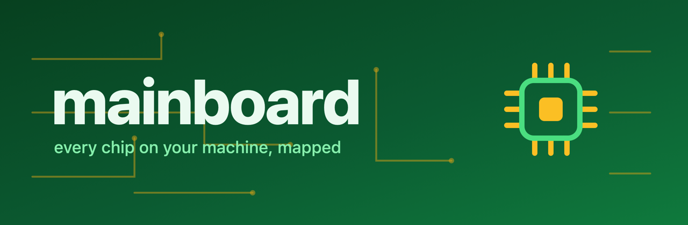

<div align="center" markdown>
{ width="760" }
</div>

# mainboard

**Hardware topology and machine snapshots for Python.**

mainboard answers a simple question: what is this machine made of, and what can Python safely know about it? It exposes CPUs, GPUs, and NPUs as typed `Unit`s with shared snapshot semantics, and probes the host into one serializable `MachineSnapshot` covering cpu, memory, gpus, npus, environment, board, and toolchain, without forcing every machine through a CUDA-only model.

## Quickstart

```sh
pip install mainboard
mainboard
```

The base install is light and pure Python, covering CPU and Apple probing with nothing CUDA-related pulled in. For NVIDIA GPU detection and telemetry install the `cuda` extra, `pip install mainboard[cuda]`, which brings in the CUDA Python bindings on Linux. Detection degrades gracefully to no NVIDIA devices whenever the bindings or the hardware are absent.

Working in a [chefe](https://phvv.me/chefe) project? `chefe add mainboard -l python`.

## CLI

```sh
mainboard
python -m mainboard
mainboard --color=False
```

Both commands render the same machine schematic. `--color=False` is useful for logs and terminals without color support.

## Python

```python
from mainboard import Machine

machine = Machine()
print(machine.cpu.name)
print(machine.gpus)
print(machine.npus)
print(machine.board.model)
print(machine.model_dump_json(indent=2))
```

## What mainboard Gives You

| feature | what it means |
|---|---|
| Concept-first units | `CPU`, `GPU`, and `NPU` share `kind`, `vendor`, and `snapshot()` |
| Provider isolation | Apple and NVIDIA details stay behind provider classes |
| Safe imports | Future AMD, Intel, and Qualcomm providers are import-safe stubs |
| Terminal view | `mainboard` renders a Rich schematic of memory and compute units |
| Toolchain discovery | An expandable probe registry reports C/C++/CUDA compilers and build systems on PATH, with versions |
| One-call snapshot | `Machine().model_dump_json()` returns cpu, memory, gpus, npus, environment (user, group, scheduler), board (motherboard, BIOS), and toolchain (compilers, build systems) |
| Profiling | `profile(fn)` returns a one-call bottleneck report, with `gpu_busy` / `wait_for_idle` to gate on a clean GPU |

## Platforms

| platform | status |
|---|---|
| Apple Silicon macOS | CPU, Apple GPU, and Apple Neural Engine detection |
| Linux + NVIDIA CUDA | CPU and NVIDIA GPU detection |
| Other platforms | CPU fallback plus inert future-provider stubs |

!!! warning "mainboard is early (`0.0.x`)"
    The public API is intentionally small, but provider telemetry details may still change.

Next, read the guide on [units](units.md), the [probe and snapshot](probe.md), and [profiling](profiling.md), or jump to the [environment](environment.md), [board](board.md), and [providers](providers.md) reference.
